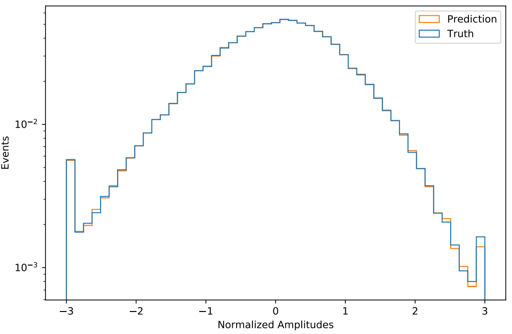
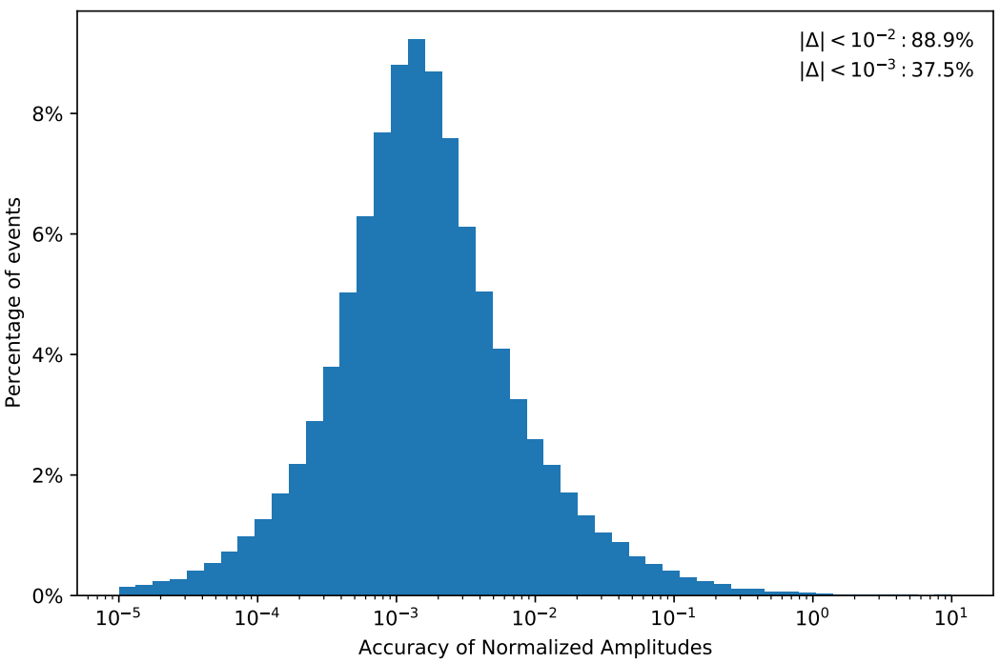
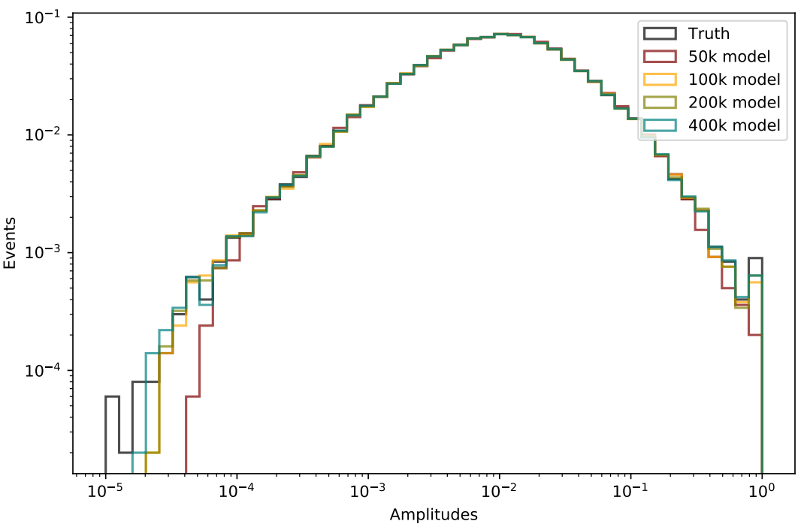
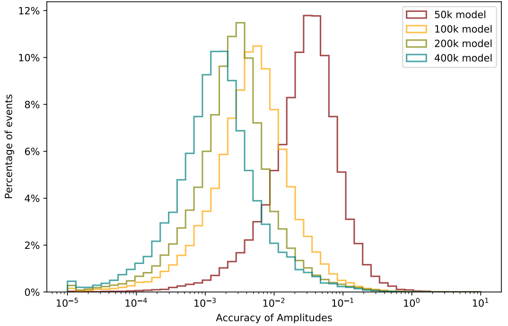
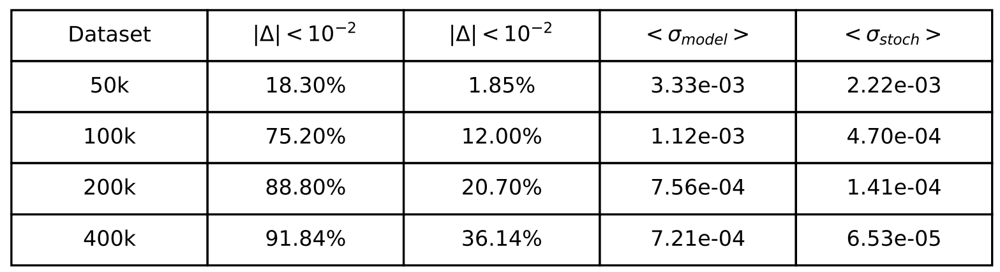
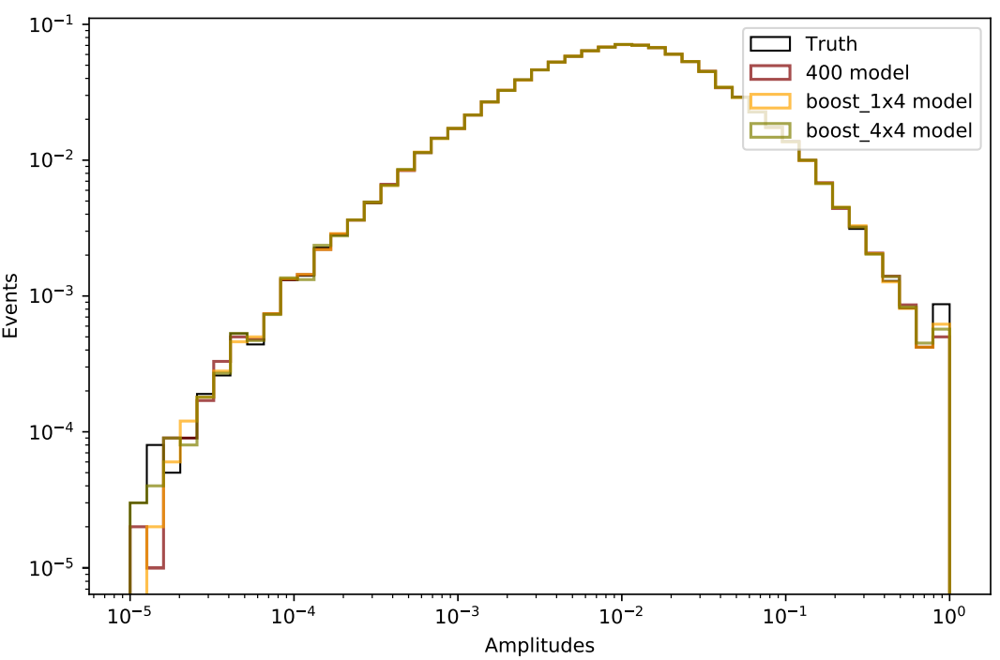
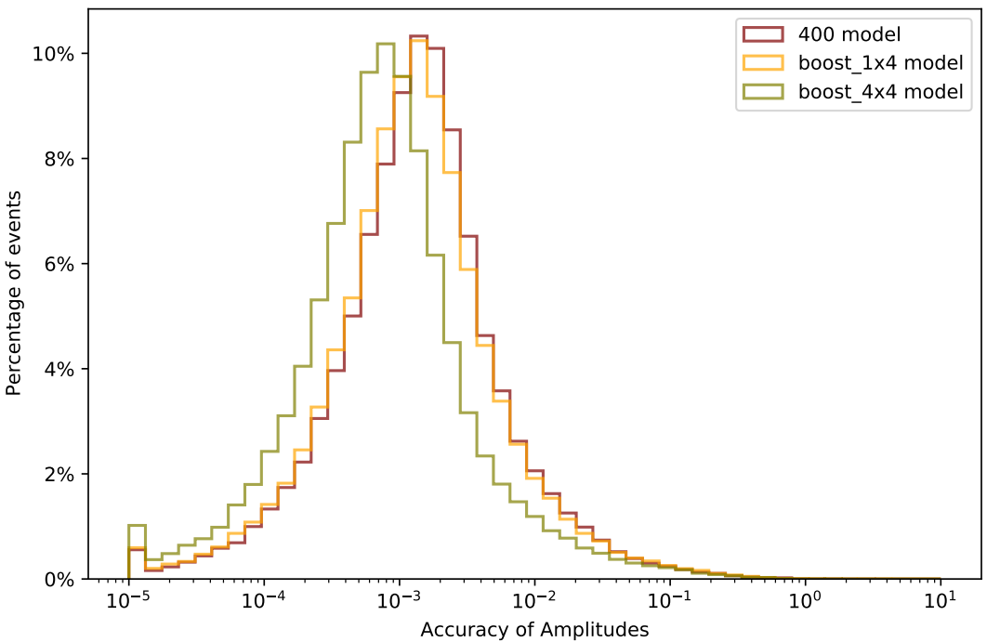
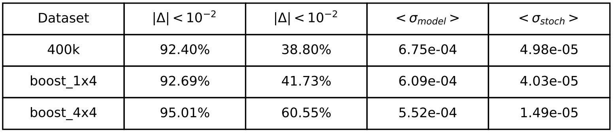

# BNN_Amplitudes_Example
Example of a Bayesian Neural Network for amplitudes regression

## Table of contents
- [About the project](#about-the-project)
    - [Bayesian NN](#bayesian-nn)
    - [Amplitude regression](#amplitude-regression)
- [Implementation](#implementation)
    - [Model implementation](#model-implementation)
    - [Main implementation](#main-implementation)
- [Test](#tests)
    - [Dataset test](#dataset-test)
    - [Data boost augmentation test](#data-boost-augmentation-test)

## About the project
This project is an example of a Bayesian Neural Network (BNN) applied to a regression problem in High Energy Physics, in particular to predict the amplitudes of scateering events. Unlike traditional NNs that provide point estimates, BNNs offer a probabilistic approach by estimating a distribution over the network's weights, allowing for more robust predictions and uncertainty quantification. This makes BNNs ideal for tasks like amplitude regression, where precise modeling of particle interactions and scattering amplitudes is essential for accurate physical predictions and analysis.
The dataset can be found at https://drive.google.com/drive/folders/1Y4EjCt3qJl13nhqCtXCHGlKVLNv5GlyS?usp=sharing .
For additional ML referencies: Gal, Yarin. “Uncertainty in Deep Learning.” (2016). 


### Bayesian NN
BNNs extend traditional NNs by modeling network parameters as probability distributions rather than fixed values. This approach allows the network to produce not just a single output, but a distribution of possible outputs, providing both a mean prediction and an associated uncertainty. 
Instead of learning the optimal weights $w$ to approximate the training dataset $D$, as a traditional NNs, a BNN learns the posterior weights distribution $p(w|D)$, which is the probability to a have a set of weight $w$ given the dataset $D$.

Since the posterior cannot usually be evaluated analytically, $p(w|D)$ is approximated by a variational distribution $q_{\theta}(w)$, depending on the network parameters $\theta$. This method is called variational inference. 
In order to obtain the best parameters $\theta$ to approximate the posterior, we can minimize the Kullback-Leibler-divergence (KL) between the two distributions. The KL evaluates the difference between two probability distributions and it is null for identical distributions. 
The KL between $q_{\theta}(w)$ and $p(w|D)$ is:
```math
KL \left(q_{\theta}(w), p(w|D) \right) = \int \, dw \, q_{\theta}(w) \, log \left(\frac{q_{\theta}(w)}{p(w|D)} \right) \quad .
```

Using the Bayes theorem, we can rewrite the posterior as:
```math
p(w|D) = \frac{p(D|w) \cdot p(w)}{p(D)} 
```
where $p(D|w)$ is likelihood distribution of observing the dataset $D=(X, Y)$ for the given network with weights $w$, $p(w)$ is the prior probability and $p(D)$ is the model evidence. 
The prior can be chosen freely and corresponds to our knowledge of the weights distribution before seeing the data. 
The model evidence represents the probability of having the dataset $D=(X, Y)$ with input $X$ and result $Y$. 
Substituting this last formula in the KL formula, we obtain the loss that we want to minimize:
```math
KL \left(q_{\theta}(w), p(w|D) \right) = \int \, dw \, q_{\theta}(w) \, \left[ log \left(\frac{q_{\theta}(w)}{p(w)} \right) - log \left(p(D|w) \right) + log \left(p(w) \right) \right]
```
The first term is a KL term between the variational distribution $q_{\theta}(w)$ and the prior distribution $p(w)$. The second term is called is called negative log-likelihood (NLL) and it depends on the posterior probability. The third term depends only on the the model evidence. It can be omitted because it is independent of $\theta$, so it is not relevant for the minimization of KL respect to $\theta$. Using a MC estimator for the NLL, we can simplified the total KL loss as:
```math
Loss(\theta) = KL \left(q_{\theta}(w), p(w) \right) - \mathcal{E}_{q_{\theta}(w)} \left[log \left(p(D|w) \right) \right]
```
The $KL \left(q_{\theta}(w), p(w) \right)$ depends only on the network parameters and not on the training data. Since the network parameters are compared to the prior, which has no data information and it has a simple distribution, this loss term acts as a regularization term, preventing the network parameters to become too large or complex. 
The NLL depends on the error predictions and their estimated uncertainty. 

As we said, the choice of the prior distribution is free, but a general choice for its simplicity is a gaussian approximation, with null mean and standard deviation equal to 1. Using this approximation, the KL loss term can be simplified as: 
```math
KL \left(q_{\theta}(w), p(w) \right) \approx \sum_i \frac{1}{2} \left( \mu_i^2 + \sigma_i^2 - log(\sigma_i^2) - 1 \right)
```
where $\mu_i, \sigma_i$ are respectively the mean and standard deviation of the weight distribution $i$.
Similarly, using a gaussian approximation for the variational distribution, we can approximate the NLL as:
```math
NLL(y_i, \mu_i, \sigma_i) \approx \frac{(\mu_i - y_i)^2}{2\sigma_i^2} + log(\sigma_i) \quad .
```


### Amplitude regression
Amplitude emulation is a regression problem where the input are the 4-momenta of each particle partecipating to the scattering and the result is the amplitude of the corresponding scattering event. 
To evaluate the prediction over the test dataset, we sample the network parameters $N$ times from the BNN and predict the output for each sample, obtaining $N$ predictions for each test event. 
The output of the sampled $j$ BNN (with fixed $\theta$ parameters) for input $x_i$ are $(\mu_{i, j}, \sigma_{i, j})$. 

We can use the sampled distribution of $\mu_{i, j}, \sigma_{i, j}$ to define a predictive mean $\mu_i$ and a predictive standard deviation $\sigma_i$ for the $i$ event. 
We define the predictive mean as:
```math
\mu_i = \frac{1}{N} \sum_j^N \mu_{i, j} \quad .
```
The predictive standard deviation $\sigma_i$​ is defined as the combination of two sources of uncertainty: model uncertainty, $\sigma_{model_i}$, ​and stochastic uncertainty, $\sigma_{stoch_i}$. The model and stochastic uncertainty are respectively defined as:
```math
\sigma_{model_i} = \frac{1}{N} \sum_j^N (\mu_{i} - \mu_{i, j})^2
```
```math
\sigma_{stoch_i} = \frac{1}{N} \sum_j^N \sigma_{i,j}^2 \quad .
```
$\sigma_{model_i}$ represents the statical uncertainty in the prediction. It vanishes in the limit of perfect trainig.
$\sigma_{stoch_i}$ represents the systematic uncertainty in the prediction. It can reflect poor or noisy training data, non-optimal network architecture choice or hyper parameters tuning. In the limit of perfect training it approaches a plateau. 


## Implementation
### Model implementation 
The bayesian layer and the bayesian model are defined in the BNN_model.py file. These classes are taken and modified from https://github.com/heidelberg-hepml/ml-tutorials.git . The implemented bayesian linear layer uses the local reparametrization trick introduced in arXiv:1506.02557v2. This trick guarantees a more efficient estimator for the training loss, which has lower computational complexity and variance, and it can be trivially parallelized.

The KL and NLL losses corresponds to the losses obtained above with the gaussian approximation for both prior and variational distribution.


### Main implementation
An example of a simple training and evaluation over a test dataset of the BNN model described before is implemented in the BNN_main.py file. 
This test can be done for two different processes which are: $d \bar{d} \to Z g g$ and $d \bar{d} \to Z g g g$. 

The input to the BNN consists of the 4-momenta of the particles involved in the event, which are preprocessed using standardization. In addition, we provide the network with the kinematic invariants of the momenta, specifically all combinations of $p_i \cdot p_j$, where $p_i, p_j$ are the momenta of different particles. Since the amplitudes are known to depend on these kinematic invariants, passing them directly as inputs allows the network to bypass the need to learn this dependence from scratch, improving both training efficiency and model performance. 

The amplitudes, which are the true values of the network output, are preprocessed trough logarithm and standardization, such that: $y_i = \frac{log(A_i) - mean \left(log(A_i) \right)}{std \left( A_i \right)}$. 

The plots below show some of the plots produced by BNN_main.py . In the following plot we can observe the total training and validation losses. We can observe that traing is interrupted by the EarlyStopper function after a period equal to 100 epochs with no improvements in the mse validation loss.
\
 
\
\
In the following plots we can observe respectively the normalized network outputs compared to their true values and their accuracy, defined as $\delta = \frac{\mu_i - y_i}{y_i}$. We can observe that the network reaches an high accuracy. 
\




## Tests
In the following 2 example tests, we use the model defined in BNN_main.py to study respectively the dataset lenght and data augmentation influences on accuracy and uncertainty.


### Dataset test
Here we test 4 different training datasets with lenght respectively equal to: 50000, 100000, 200000 and 400000. Differently from the previous plots, here the outputs are at the amplitude level and not normalized. As we could expect the accuracy of the model lower events is worse, in particularly for the less populated areas (small and large amplitudes). 
\

\
\
Similarly, the accuracy plot shows a big difference between the "50k" model and the others, while this difference tends to decrease with larger datasets.  
\

\
\
In the following table we observe the resume of the results achieved by each model. As we said, this table shows that the accuracy tends to improve with the increase lenght of the dataset and to converge to a given value. Moreover, both uncertainties tend to improve (decrese) with the increasing of the training lenght. For the model (statistical) uncertainty this is expected because, a larger training dataset implies a better training. For the stochastic (systematic) uncertainty, since the model are identical, this can be associated with improvemnt of the data quality, due to more populated phase-space. 
\



### Data boost augmentation test
Here we test data augmentation through physical information. We know that scattering events are invariant under boost transformation along the beam axis and rotation around it. We applied a random boost and a random rotation to each event to obtain aumented events with the same amplitudes.

We tested 3 different training dataset, called: "400", given by 400000 non-augmentated events, as a standard case, "boost_1x4", given by 400000 events, composed by 100000 non-augemented events and 300000 augemented events (obtained by the non-augmented 100000 events), "boost_4x4" composed by 1600000 events in the same way as "boost_1x4" but with the same non-augmented events of "400" dataset. 

From the amplitudes plot we observe that all 3 model, achieved a high precision, with similar distribution.
\

\
\
In the accuracy plots, we can observe that the "400" model has a similar accuracy to the "boost_1x4" model, which is obtained by a model with 1/4 its original training sample and then augmentated. While "boost_4x4" reaches slightly more accurate predictions. 
\

\
\
Finally, in the following table, we observe that similarly to the accuracy, also the uncertainties tend to improve for augmented dataset, suggesting that the applied transformation tends to populate also less populated regions, similarly to sample additionally events.
\

